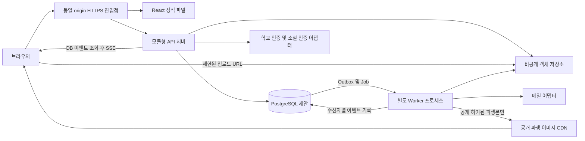

# 01. 시스템 아키텍처

기준일: 2026-10-01 · 상태: **구현 전 설계 제안**

## 1. 목적과 적용 범위

현재 React 프론트엔드를 실제 다중 사용자 서비스로 전환하기 위한 전체 구성이다. 현재 서버·DB·OAuth·학교 인증·실시간 전달은 구현되어 있지 않다. 기술 제품의 버전과 배포 사업자는 미정이다.

01~09 문서는 기존 설계를 역할별로 분리하고 프론트 대조 결과를 보완한 최신 검토안이다. 번호 문서 사이에서는 03이 데이터, 04가 전이, 06이 API, 07이 권한의 기준이다. 기존 문서는 배경·요구사항 근거로 보존한다. 새 제안이 기존 운영 정책의 승인이나 구현 완료를 의미하지 않는다. 미결정 D-01~D-12는 [개발·검증 계획](개발_검증_계획.md)을 유지한다.

| 범위 | 내용 |
| --- | --- |
| 핵심 | 공개 의뢰 → 지원 → 선정 / 전문가 지정 요청 → 수락 → 워크룸 → 계약 → 완료 |
| 탐색·신뢰 | 전문가·작업물·프로젝트 검색, 찜, 학교 인증, 실제 완료 후기, 버전별 공개 승인 |
| 운영 | 파일 검사, 알림, 문의·신고, 감사, 백업·복구 |
| 제외 | PG·에스크로·정산·환불·외부 전자서명 |
| 디자인 대기 | 포트폴리오 등록·수정 화면과 콘텐츠 블록 스키마(D-08) |

한 계정이 의뢰자·수행자를 겸한다. MVP 프로젝트당 수행자 1명, 재모집·재지원 보류는 D-09의 제안이다.

## 2. 전체 구성

API는 `/api/v1`, 이벤트는 `/api/v1/events`로 제공한다. API와 Worker는 같은 코드 기반과 관계형 DB를 사용한다. 파일 본문은 제한 URL을 통해 저장소와 직접 교환하고 API는 권한·메타데이터·연결을 관리한다.

## 3. 구성별 책임

| 구성 | 책임 | 초기 선택 이유 |
| --- | --- | --- |
| React SPA | 화면, URL 검색 조건, 입력 중 상태, API 결과 표시 | 기존 컴포넌트를 기능별로 연결 |
| 단일 API 앱 | 인증·객체 권한·도메인 명령·조회 DTO | 선정·계약·완료를 한 DB 트랜잭션으로 묶음 |
| 관계형 DB | 계정·거래·버전·유일성·세션·작업 기록 | 관계와 동시성 제약의 기준 |
| 객체 저장소 | 격리 원본, 검사 완료 파일, 공개 파생본 | 바이너리를 DB나 localStorage에 저장하지 않음 |
| Worker | 파일 검사, PDF, 메일, 알림·이벤트 전달 기록 | 외부 실패를 업무 커밋과 분리 |
| SSE | 저장된 변경을 당사자에게 안내 | 전송은 POST, 재조회는 REST |

별도 검색 엔진·Redis·메시지 브로커는 초기 필수 구성으로 두지 않는다. 도입 조건은 측정된 검색 품질, DB 부하, 이벤트 지연이다. 구현 프레임워크는 Spring Boot/NestJS 후보 중 팀 역량에 따라 결정한다(D-01).

## 4. 데이터와 신뢰 경계

1. 사용자 ID·권한·인증·집계·SIGNED/COMPLETED는 서버가 결정한다.
2. 공개 응답은 계정 이메일·학교 증빙·지원서·메시지를 포함하지 않는다.
3. 프로젝트가 PUBLIC이어도 DRAFT는 작성자만 조회한다. DIRECT_ONLY는 당사자만 조회한다.
4. 학교 인증과 거래 완료 작업 검증을 별도 필드로 제공한다.
5. 선정·합의·완료는 DB 커밋 후 성공이다. 알림과 PDF 실패는 거래를 되돌리지 않는다.
6. 계약과 지원 자료는 당시 버전을 참조한다. 이후 프로필·작업물 편집으로 합의 근거가 바뀌지 않는다.
7. 로그아웃·정지·권한 변경은 REST와 이미 열린 SSE 연결에 모두 적용한다.

세션·OAuth·개별 데이터 접근은 [07 권한 매트릭스](07_권한_매트릭스.md), 저장소와 이벤트는 [08 파일·이벤트 흐름](08_파일_이벤트_흐름.md)을 따른다.

## 5. 프론트 전환 경계

| 현재 코드 | 전환 내용 |
| --- | --- |
| `auth.js`, `Auth.jsx` | 서버 세션 초기화, 로그인 유지, OAuth, 인증 후 내부 경로 복귀 |
| `store.jsx` | 서버 데이터와 화면 임시 상태 분리, 계정 전환 시 캐시 폐기 |
| `pages.jsx`, `components.jsx` | 화면별 DTO와 페이지 total 사용, 작성자 요약을 카드 응답으로 수신 |
| `lib.js`, `FieldFilter.jsx` | URL 호환 어댑터, 서버 count 조회, 응답 역전 방지 |
| `forms.jsx` | 사용자별 초안, 전체 제출 검증, 멱등 생성·제출 |
| `Workroom.jsx` | `/workrooms/:id`, 방별 메시지·계약·파일·완료 상태 |
| `data.js` | 개발 전용 fixture. API 장애 시 데모로 자동 대체하지 않음 |

공개 데이터와 `isSaved`, `myProposal`, `allowedActions`는 분리 조회한다. 개인화 응답은 no-store이며 공개 CDN 캐시에 넣지 않는다. 카드마다 개별 호출하지 않고 현재 페이지 대상들을 일괄 조회한다. 구체적인 DTO와 API는 [06 API 맵](06_API_맵.md)에 정의한다.

## 6. 미결정 및 구현 순서

학교 인증 수단·대상(D-02), 신규 거래 인증 시점(D-04), 취소·분쟁(D-05), 보유 기간(D-06), 포트폴리오 없는 지원(D-07)은 승인 전 기본 제안이다. 평균 응답 시간·조회수는 측정 기준 승인 전 null/숨김 처리하고 seed 값을 운영 지표로 사용하지 않는다.

서버 기반·세션 → 분야·프로필·인증 → 탐색·초안·파일 → 지원·선정 → 지정 요청 → 계약·완료 → 후기·운영 순으로 연결한다. 파일·권한·감사는 해당 기능과 함께 구현하며 출시 직전에 추가하지 않는다.

다음: [02 백엔드 모듈 구조](02_백엔드_모듈_구조.md) · [문서 인덱스](README.md)
