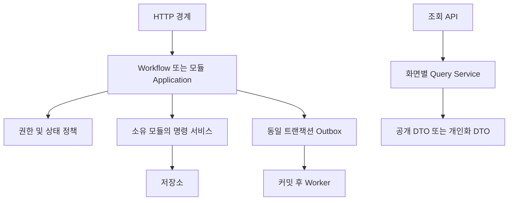

# 02. 백엔드 모듈 구조

기준일: 2026-10-01 · 상태: **구현 전 설계 제안** · 상위: [01 시스템 아키텍처](01_시스템_아키텍처.md)

## 1. 디렉터리와 계층

프레임워크와 패키지 문법은 D-01 결정 후 정한다. 아래는 논리 배치이며 생성된 코드가 아니다.

```text
backend/
  src/
    bootstrap/              API 및 Worker 조립, 설정 검증
    workflows/              모듈 간 원자적 유스케이스
    modules/
      identity/             계정·OAuth·세션·약관
      verification/         학교 인증
      taxonomy/             분야·기술·별칭
      profile/              프로필·경력·제공 서비스
      portfolio/            작업물·버전·대표작·공개 승인
      project/              공고·수정 이력
      matching/             지원·지정 요청·견적·매칭
      collaboration/        워크룸·대화·읽음
      contract/             계약·버전·동의
      delivery/             완료·후기·역할별 집계
      media/                업로드·검사·파일 연결
      notification/         알림·수신자 이벤트·메일 작업
      operations/           문의·신고·분쟁·감사
    queries/                화면별 읽기 모델과 공개 DTO
    shared/                 ID·시계·오류·트랜잭션 추상화
    infrastructure/         DB·저장소·메일·인증 어댑터
  migrations/
  contracts/                향후 OpenAPI 및 예제
  tests/                    도메인·DB·API·권한·장애 검증
```

각 모듈은 `http / application / domain / persistence`를 논리적으로 구분한다. 작은 모듈까지 의미 없는 빈 계층을 강제하지 않는다. HTTP 경계는 입력 검증·세션 전달·응답 변환, application은 권한과 유스케이스, domain은 상태·불변 조건, persistence는 저장·잠금을 담당한다.

## 2. 데이터 소유권

| 모듈 | 소유 데이터 | 대표 명령 |
| --- | --- | --- |
| Identity | users, oauth_identities, sessions, auth_tokens, consents | SignUp, Login, LinkIdentity, RevokeSessions |
| Verification | school_verifications | ApplyVerification, DecideVerification |
| Taxonomy | categories, service_fields, skills, aliases, field_skills | ResolveField, ResolveSkill |
| Profile | profiles, careers, offered_services, 분야·기술 연결 | UpdateProfile |
| Portfolio | portfolios, versions, featured, publication_approvals | PublishPortfolio, RequestPublication |
| Project | projects, project_revisions, 분야·기술 연결 | SaveDraft, PublishProject, CloseRecruitment |
| Matching | proposals, revisions, snapshots, direct_requests, terms, matches | SubmitProposal, QuoteDirectRequest |
| Collaboration | workrooms, conversations, members, messages | SendMessage, MarkRead |
| Contract | contracts, versions, acceptances | DraftContract, PublishVersion |
| Delivery | completion_requests, reviews, profile_stats | RequestCompletion, WriteReview |
| Media | media_objects, uploads, media_links | AuthorizeUpload, CompleteUpload, LinkMedia |
| Notification | notifications, recipient_streams, user_events | MaterializeEvent, SendMail |
| Operations | cancellation_requests, reports, tickets, replies, audit_logs | RequestCancellation, ResolveReport |

Outbox·jobs·idempotency_records·processed_events는 공통 인프라 저장소가 관리한다. 취소 합의 정책은 Operations가 소유하고 프로젝트 변경은 workflow를 통해 Project에 요청한다.

## 3. 모듈 간 호출



다른 모듈 테이블 직접 쓰기는 금지한다. 조회 서비스는 권한 조건을 적용한 읽기 전용 join을 허용하고, 화면을 위해 N개의 내부 HTTP 호출을 만들지 않는다. 모듈 간 공개 인터페이스의 DTO는 DB 엔터티와 분리한다.

## 4. 트랜잭션 담당 Workflow

| Workflow | 참여 모듈 / 같은 트랜잭션 |
| --- | --- |
| SelectProposal | Project 잠금 → Matching 선정 revision → Collaboration 방·대화 → Contract 최초 초안 → Outbox |
| AcceptDirectRequest | 요청·최신 terms 잠금 → DIRECT_ONLY Project → Match·방·계약 초안 → Outbox |
| AcceptContractVersion | Project → Contract 잠금 → 현재 검토본 동의 → 체결본 갱신 → 최초 체결이면 IN_PROGRESS → Outbox |
| ApproveCompletion | Project → Contract → Completion 잠금 → 기준 체결본 확인 → COMPLETED → Outbox |
| ApproveCancellation | Project → 취소 요청 잠금 → 양측 합의 → CANCELLED → 활성 검토·완료 요청 종료 → Outbox |

공개 거래의 공통 잠금 순서는 Project → Proposal/Contract → 하위 요청이다. 지원 수정·철회도 Project → Proposal 순서를 사용한다. 지정 요청은 DirectRequest를 먼저 잠근 뒤 아직 외부에 없는 신규 Project를 생성한다. 계약 발행·동의·완료 요청·취소는 동일 Project 잠금으로 경합을 직렬화한다.

멱등 기록은 명령 트랜잭션에서 사용자+메서드+정규 경로+키로 단일 실행을 확보한다. 성공 응답과 body hash를 함께 커밋한다. 외부 호출을 잠금 유지 중 수행하지 않는다. 상세 경쟁 조건은 [04 상태도](04_도메인_상태도.md), [05 시퀀스](05_핵심_시퀀스.md)를 따른다.

## 5. 프론트와 Query Service

| Query | 필요한 데이터 |
| --- | --- |
| ProjectList/Detail | 작성자 요약, 조건, 지원자 수, 마감 시각 |
| ExpertList/Detail | 공개 프로필, 대표작·이미지, 역할별 후기·완료 통계 |
| PortfolioList/Detail | 공개 버전, 작성자 요약, 승인 배지, 이미지 |
| ViewerState | 페이지 내 대상별 찜·본인 지원·allowedActions |
| MyDashboard | 사용자별 의뢰·지원·요청·방 건수 및 목록 |
| WorkroomOverview | 양측, 상태, 체결본·검토본, 활성 완료·취소 요청, 최근 대화·파일 |

프론트는 DTO를 컴포넌트 표시 형태로 변환한다. `PortfolioCard`에서 전체 전문가 seed를 찾는 방식은 제거한다. 권한 안내용 allowedActions는 서버 변경 권한 검사를 대체하지 않는다.

## 6. 구현 검증

- 상태 전이 단위 검증: 금액·날짜·역할·버전·숨김 콘텐츠.
- 실제 DB 검증: 동시 선정, 견적 갱신/수락, 계약 발행/동의, 완료/변경 계약, 트랜잭션 롤백.
- 계약 검증: [06 API 맵](06_API_맵.md)에서 OpenAPI를 작성하고 실제 DTO·오류와 대조.
- 권한 검증: A/B/C 사용자로 ID 교체, 탈퇴·정지·인증 만료, 파일 및 SSE 접근 확인.
- 장애 검증: 응답 유실 재전송, Worker lease 만료, 중복 이벤트, PDF 실패, SSE 재연결.

다음: [03 ERD](03_ERD.md) · [문서 인덱스](README.md)
