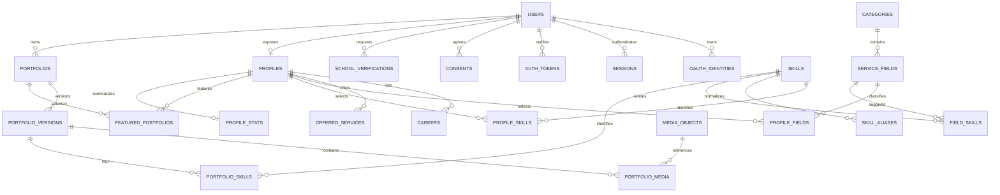
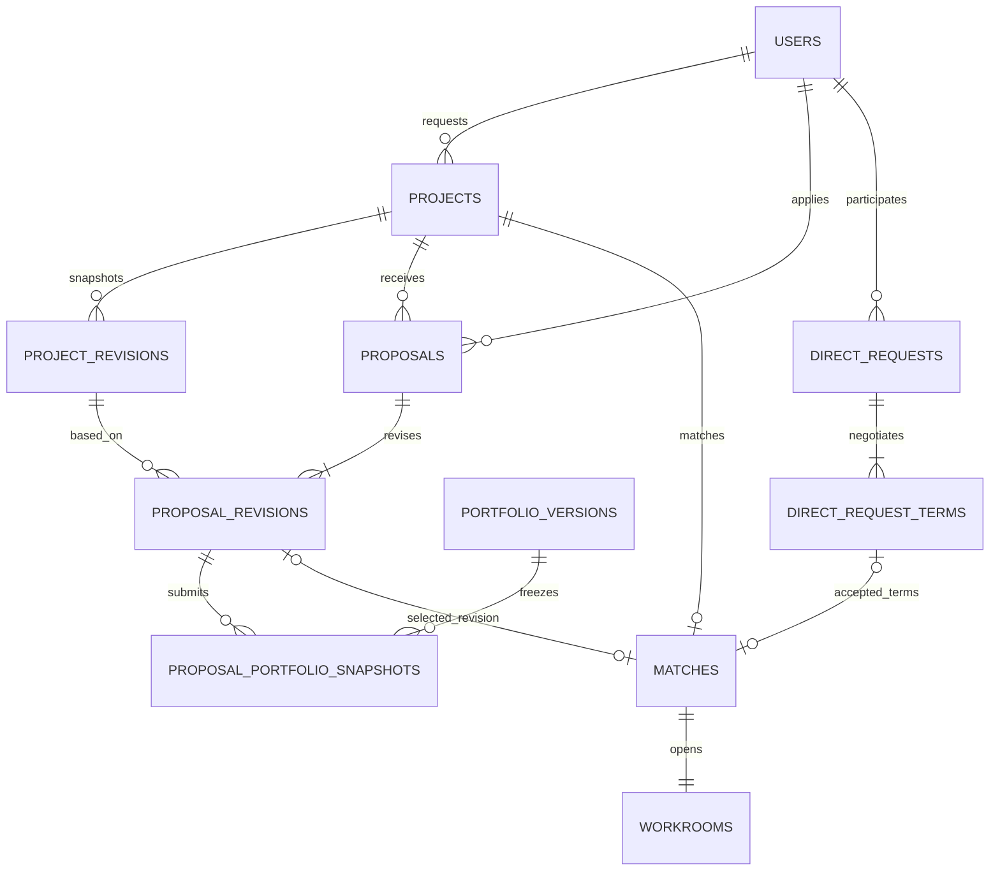
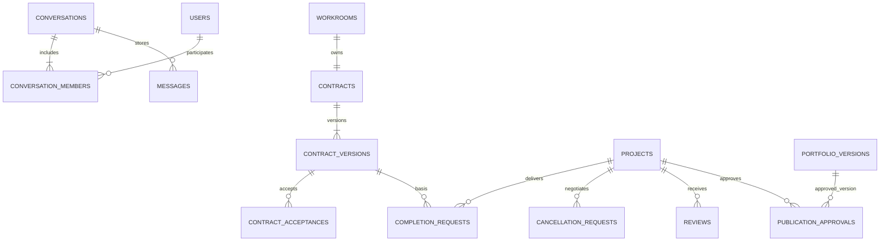

# 03. ERD

기준일: 2026-10-01 · 상태: **논리 DB 설계 제안, 실행 가능한 migration 아님**

기존 [ERD 초안](백석대학교_긱창업_플랫폼_ERD.md)을 보존하고 합의 버전·인증·파일·이벤트 관계를 보완했다. PostgreSQL을 기본 후보로 하며 실제 타입·제약 SQL은 구현 시 검증한다. 도식은 영역별 핵심 관계, 표는 추가 테이블과 제약의 기준이다.

## 1. 공통 규칙

- 엔터티 PK는 UUID, 연결 테이블은 복합 PK/unique. 시각은 UTC, 날짜만 필요한 값은 date, 화면은 Asia/Seoul이다.
- `version`은 변경 충돌 검사 정수, `revision_no`/`sequence`는 이력 순서다. 서로 대체하지 않는다.
- 금액은 KRW 정수. FIXED는 `0 < min = max`, RANGE는 `0 < min <= max`, NEGOTIABLE은 둘 다 null. API 상한은 JSON 안전 정수 이내의 운영 설정이다.
- 기간은 1~365일 제안. 모집 날짜는 서울 기준 다음 날 00:00을 배타적 `closes_at`으로 변환한다.
- 각 리소스의 current/selected/signed 포인터는 해당 부모의 자식만 가리켜야 한다. 단순 FK 외에 부모 ID와의 복합 FK 또는 같은 트랜잭션 검사를 명시적으로 구현한다.
- 이력·발행 버전은 내용 불변이다. JSON snapshot에도 schemaVersion과 허용 필드 스키마를 둔다. 비밀·증빙 원문은 스냅샷에 복제하지 않는다.

## 2. 계정·프로필·작업물

| 테이블 | 주요 필드 / FK | 제약·의미 |
| --- | --- | --- |
| users | id, normalized_email?, password_hash?, status, email_verified_at? | 이메일이 있으면 unique. 소셜 이메일 미제공 허용; 비밀번호 null 허용. ACTIVE/SUSPENDED/WITHDRAWN |
| oauth_identities | id, user_id, provider, provider_subject | `(provider, provider_subject)` unique. 이메일 일치 자동 연결 금지 |
| sessions | id, user_id, token_hash, remember, idle_expires_at, absolute_expires_at, revoked_at | token_hash unique, 서버 폐기. 세션 원문 저장 금지 |
| auth_tokens | id, user_id?, token_hash, purpose, expires_at, used_at | 확인·재설정·OAuth state 목적 분리, 일회용 원자 소비. OAuth state는 사전 인증 문맥과 연결 |
| consents | id, user_id, document_type, document_version, agreed_at, withdrawn_at | 문서별 필수/선택 구분, 당시 동의 이력 |
| school_verifications | id, user_id, method, affiliation_type, state, expires_at, evidence_media_id? | 승인 변경 시 사용자 잠금, 현재 승인 최대 1개. 유효성은 상태와 시각으로 판정 |
| profiles | id, user_id, display_name, headline, bio, avatar_media_id?, availability, visibility, version | user_id unique. AVAILABLE/BUSY는 본인 설정 제안 |
| categories / service_fields | id, label, enabled, sort_order / category_id, group_label? | 세부분야만 검색 leaf. 그룹 제목은 UI 분류이며 독립 검색 조건 아님 |
| skills / skill_aliases | id, normalized_label / skill_id, normalized_alias | 표준명·별칭 각각 unique. 임의 검색 입력으로 생성 금지 |
| profile_fields / profile_skills / field_skills | profile_id+field_id / profile_id+skill_id / field_id+skill_id | 각 쌍 unique, N:M |
| careers / offered_services | id, profile_id, title, description, dates 또는 조건 | 소유자만 수정, 서비스별 분야·기술 연결은 별도 join으로 상세화 |
| portfolios | id, owner_id, visibility, current_version_id, published_version_id?, version | PRIVATE/PUBLIC, 편집 중 버전과 공개 버전 분리 |
| portfolio_versions | id, portfolio_id, revision_no, title, summary, role, field_id, content, schema_version | `(portfolio_id, revision_no)` unique. content는 D-08 디자인 이후 확정 |
| portfolio_skills / portfolio_media | portfolio_version_id+skill_id / portfolio_version_id+media_id, position | 버전별 기술·파일 고정. media는 READY만 연결 |
| featured_portfolios | profile_id, portfolio_id, position | 쌍과 `(profile_id,position)` unique, 프로필 잠금으로 최대 3개, 본인 공개 작업만 |
| profile_stats | profile_id, provider_completed_count, requester_completed_count, provider_rating_sum/count, requester_rating_sum/count, updated_at | 역할별 공개 후기만 집계. 평균은 count=0이면 null. 원천으로 재계산 가능 |

공개 작업물 변경은 새 버전을 만들고 publish에서 공개 포인터를 바꾼다. 승인 배지는 `published_version_id`와 승인 대상 버전이 일치할 때만 표시한다. 프로필 대표 이미지는 현재 공개 대표작 또는 허용 기본 이미지로 계산한다.

## 3. 프로젝트·지원·지정 요청·매칭

| 테이블 | 주요 필드 / FK | 제약·의미 |
| --- | --- | --- |
| projects | id, owner_id, title, summary, content, deliverables, requirements, reference_url?, budget_type/min/max, days, mode, closes_at?, visibility, status, current_revision_id?, version | PUBLIC/DIRECT_ONLY. DRAFT 부분 입력 허용, publish에서 전체 검증. DIRECT_ONLY 매칭은 모집 없이 생성하여 closes_at null |
| project_revisions | id, project_id, revision_no, terms_snapshot, created_at | 쌍 unique. 게시/게시 후 변경/직접 매칭 조건 보존 |
| project_fields / project_skills | project_id+field_id / project_id+skill_id | 등록 대표 분야 1개 제안, 검색은 다중 분야 OR. 미등록 태그는 별도 제한된 문자열 목록 |
| proposals | id, project_id, applicant_id, status, current_revision_id, version, rejection_reason? | `(project_id,applicant_id)` unique. 자기 지원 금지 |
| proposal_revisions | id, proposal_id, revision_no, project_revision_id, amount, days, content, created_at | 제출·수정 때 생성. 선택 후 수정 금지 |
| proposal_portfolio_snapshots | proposal_revision_id, portfolio_version_id, snapshot_metadata, explicit_share | 버전별 최대 3개(D-07). 비공개 자료는 해당 의뢰자 열람 동의 기록 |
| direct_requests | id, sender_id, recipient_id, status, expires_at, latest_terms_id, accepted_terms_id?, version | 자기 요청 금지, PENDING 중 조건 변경과 수락은 같은 행 잠금 |
| direct_request_terms | id, direct_request_id, revision_no, kind, author_id, terms_snapshot, created_at | `(request_id,revision_no)` unique. ORIGINAL 1개, 이후 QUOTE. 내용 불변 |
| matches | id, project_id, provider_id, proposal_revision_id?, direct_request_id?, direct_terms_id?, agreed_terms_snapshot | project_id unique. 공개 지원 출처 또는 지정 요청 출처 중 정확히 하나. direct_request_id unique |
| workrooms | id, project_id, match_id, conversation_id, status | project_id/match_id/conversation_id 각각 unique, Match와 같은 트랜잭션 |

직접 매칭은 `proposal_revision_id IS NULL`이며 direct_request_id·direct_terms_id가 모두 있어야 한다. 공개 매칭은 반대다. selected proposal의 project와 match.project가 같은지, terms가 해당 request의 최신 버전인지 검사한다. Match의 agreed_terms_snapshot은 초기 계약 초안의 근거이며 이후 변경 계약으로 덮지 않는다.

## 4. 협업·계약·완료

| 테이블 | 주요 필드 / FK | 제약·의미 |
| --- | --- | --- |
| conversations | id, project_id?, applicant_id?, direct_request_id?, next_sequence | 공개 문의는 project+applicant, 지정 문의는 direct_request 중 하나. 문맥별 unique |
| conversation_members | conversation_id, user_id, last_read_sequence | 복합 PK, 읽음 단조 증가, 실제 최대 순번 이하 |
| messages | id, conversation_id, sender_id?, client_message_id?, source_event_id?, sequence, kind, text, created_at | 방+sequence unique; USER는 방+sender+client ID unique; SYSTEM은 방+source_event unique |
| contracts | id, workroom_id, signed_version_id?, review_version_id?, version | workroom_id unique. 초기 signed=null, review=최초 DRAFT |
| contract_versions | id, contract_id, sequence, author_id, base_signed_version_id?, status, body, content_hash?, document_media_id?, document_status | 쌍 unique. 발행부터 body/hash 불변. 발행 DRAFT를 수정할 때는 새 버전 생성 |
| contract_acceptances | contract_version_id, user_id, content_hash, accepted_at | 복합 PK, 양측만 허용, 동일 발행 해시 확인 |
| completion_requests | id, project_id, requester_id, contract_version_id, state, note, version, decided_by?, reason? | PENDING 프로젝트당 최대 1개, 기준 signed_version 고정 |
| cancellation_requests | id, project_id, requester_id, state, reason, version, decided_by? | PENDING 프로젝트당 최대 1개. 상대만 승인/거절, 요청자만 철회 |
| reviews | id, project_id, author_id, subject_id, subject_role, rating, body, visibility | project+author unique, 1~5 정수, subject와 역할은 서버 결정 |
| publication_approvals | id, project_id, portfolio_version_id, requester_id, state, decided_by?, version | project+portfolio_version unique. 완료 수행자의 요청, 의뢰자 결정 |

최초 계약 초안 작성자는 프로젝트 의뢰자로 정하는 제안이다. 대체 초안을 생성한 당사자가 해당 버전 작성자가 된다. 활성 취소 합의 요청 중 계약 발행·동의·완료 변경은 중지한다. 완료 요청 PENDING 중 변경 계약 생성·발행은 금지한다. 상세는 [04 상태도](04_도메인_상태도.md)에서 정의한다.

## 5. 파일·알림·운영

| 테이블 | 주요 필드 | 제약·의미 |
| --- | --- | --- |
| media_objects | id, owner_id?, source_job_id?, object_key, object_version?, state, mime, size, checksum, created_at | object_key unique, 사용자 업로드 또는 서버 생성 출처 구분 |
| uploads | id, media_id, purpose, target_type/id, expires_at, state | media_id unique. 발급·완료 권한과 검사 진행 참조 |
| media_links | id, media_id, target_type/id, linked_by, created_at | media+target unique. 제한된 target 유형별 존재·권한 검사; migration에서 유형별 FK 테이블로 분리 가능 |
| favorites | user_id, target_type, target_id, created_at | 세 필드 unique, 비공개/삭제 대상 반환 제외 |
| notifications | id, recipient_id, event_id, type, target_ref, read_at | recipient+event unique |
| outbox_events | id, aggregate_type/id, aggregate_version, type, schema_version, data, occurred_at, dispatched_at? | 업무 변경과 같은 커밋. dispatched_at은 handler Job 기록 완료이며 민감 전문 제외 |
| jobs | id, event_id?, handler, dedup_key, state, attempts, next_run_at, lease_until, lease_token, last_error | handler+dedup_key unique, lease_token으로 오래된 worker 완료 방지 |
| processed_events | consumer, event_id | 복합 PK. 소비 결과와 같은 트랜잭션 |
| recipient_streams | user_id, last_sequence | 사용자당 1행, user_events 추가 전 잠금으로 전달 순번 커밋 순서 보장 |
| user_events | recipient_id, sequence, event_id, type, target_ref, created_at | recipient+sequence 및 recipient+event unique, SSE의 유한 보관 재연결 기록 |
| idempotency_records | actor_id, method, canonical_path, key, body_hash, response_status/body, expires_at | actor+method+path+key unique. 검증 실패로 예약만 남기지 않음 |
| reports | id, reporter_id, target_type/id, project_id?, status, assignee_id?, dispute_active, reason | 활성 분쟁 변경 시 Project 잠금과 감사, 일반 신고 접수만으로 자동 중단하지 않음 |
| support_tickets / ticket_replies | id, requester_id, status, assignee_id / ticket_id, author_id, body, created_at | 본인·담당자만 조회, 답변 이력 보존 |
| audit_logs | id, actor_id, action, target_ref, reason, request_id, created_at | 민감 열람·변경 기록, 비밀·메시지 전문 제외 |

파일 연결 대상에는 프로젝트 초안/수정본, 지원 revision, 지정 terms, 메시지, 워크룸, 완료 요청, 작업물 버전, 학교 증빙, 계약 문서가 포함된다. 대상별 열람 범위는 [07](07_권한_매트릭스.md), 검사와 중복 처리는 [08](08_파일_이벤트_흐름.md)를 따른다.

## 6. 인덱스·삭제·집계

| 용도 | 인덱스/정책 제안 |
| --- | --- |
| 탐색 | projects(visibility,status,created_at,id), closes_at 보조 인덱스, field/skill join 역방향 |
| 개인 목록 | projects(owner_id,created_at,id), proposals(applicant_id,created_at,id), requests(sender/recipient,status,created_at) |
| 대화 | messages(conversation_id,sequence), members(user_id,conversation_id) |
| 작업 | jobs(state,next_run_at), jobs(lease_until), user_events(recipient_id,sequence) |
| 후기 | reviews(subject_id,subject_role,visibility,created_at,id) |
| 이력 보존 | 선정 revision·체결본·완료 근거는 RESTRICT를 기본으로 보존. 사용자 탈퇴 CASCADE 금지 |
| 콘텐츠 비공개 | 공개 검색·CDN 비노출, 합의된 거래 스냅샷 열람은 별도 권한으로 유지 |
| 집계 | 완료·후기·숨김 이벤트를 멱등 반영, 역할별 원천 재계산으로 복구 |

화면의 지원자 수는 WITHDRAWN을 제외한 실제 제출자 수 제안이다. 전문가 완료 수·평점은 수행자 역할 기준, 의뢰자 요약은 의뢰자 역할 기준이다. popularity는 공개 작업물 찜 수 내림차순 제안이고 조회수·평균 응답 시간은 산식 확정 전 null이다.

실제 FK 삭제 행동, 보유·폐기 기간(D-06), 업로드 한도(D-10), 콘텐츠 블록(D-08)은 migration 전에 확정한다. 큰 도식의 순환 포인터는 생성 트랜잭션에서 null로 만든 뒤 같은 부모의 자식을 연결하는 방식으로 처리한다.

다음: [04 도메인 상태도](04_도메인_상태도.md) · [문서 인덱스](README.md)
