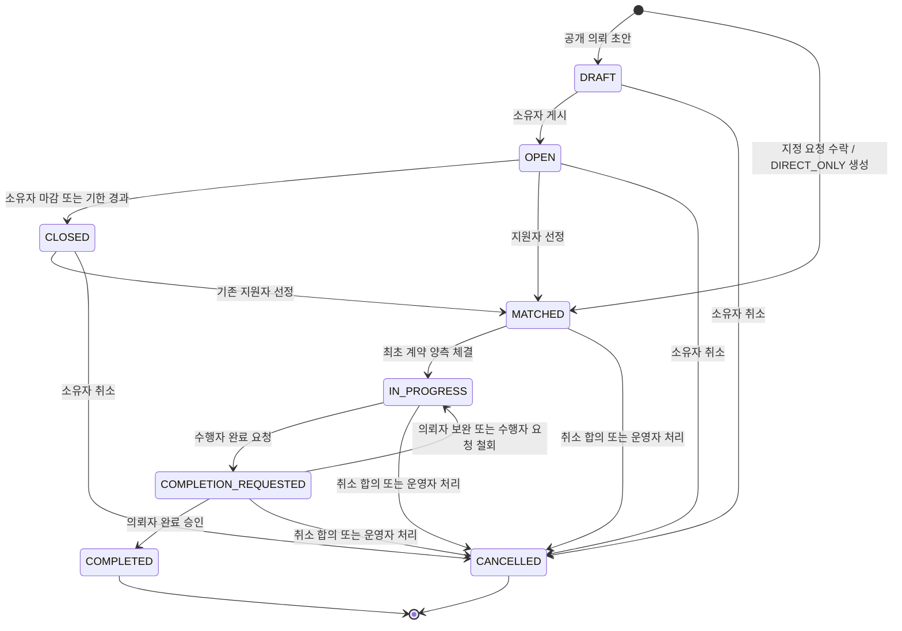
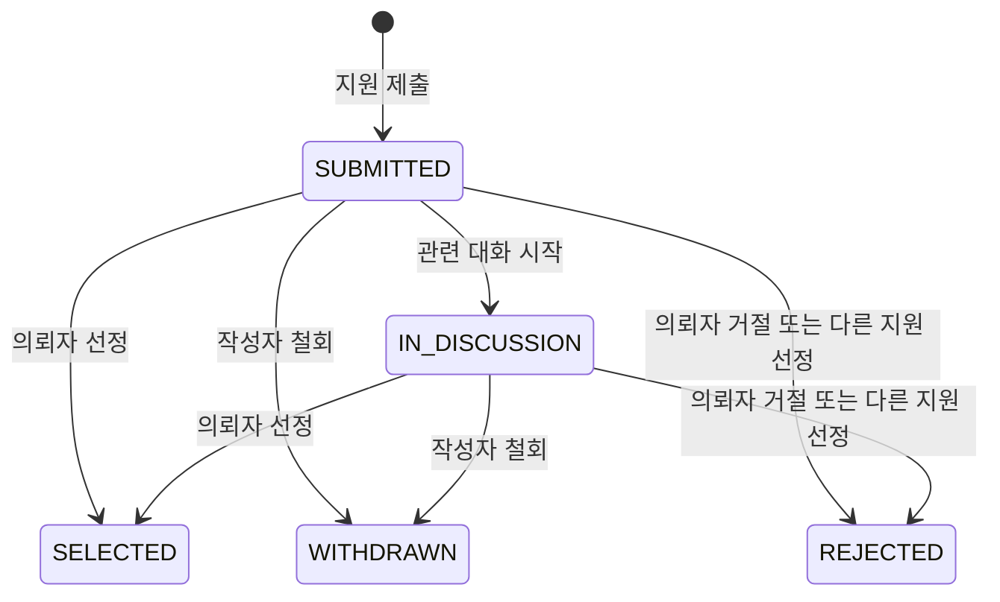
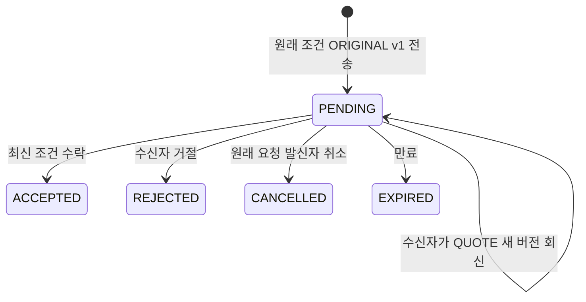
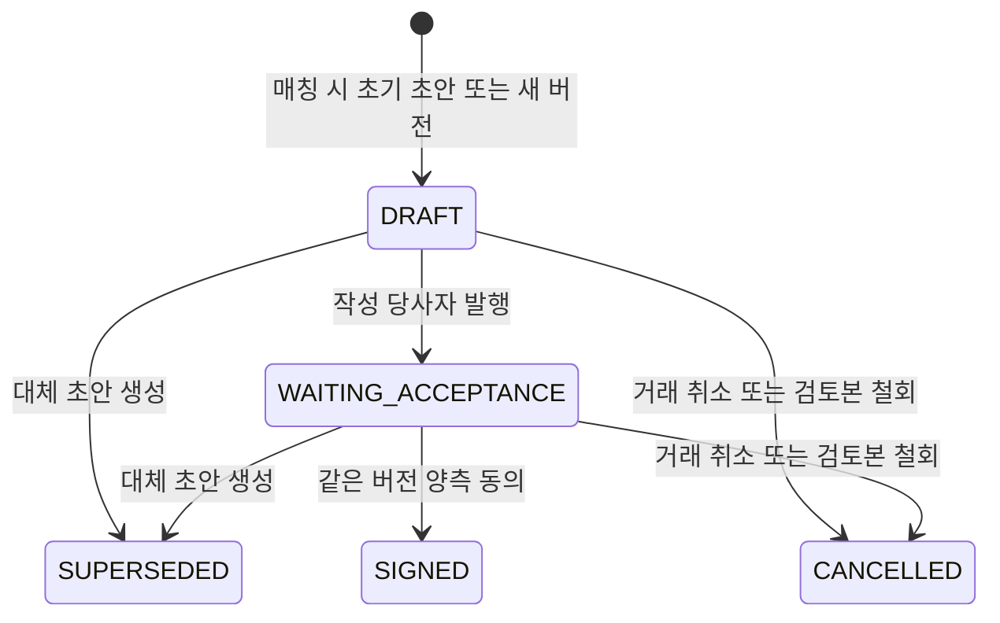

# 04. 도메인 상태도

기준일: 2026-10-01 · 상태: **구현 전 상태·정책 제안**

데이터는 [03 ERD](03_ERD.md), 호출은 [06 API 맵](06_API_맵.md), 행위자는 [07 권한](07_권한_매트릭스.md)을 따른다. D-04·D-05·D-07·D-09 정책은 승인 전이다. 도식에 없는 전이는 허용하지 않으며 클라이언트가 status를 직접 PATCH하지 않는다.

## 1. Project

| 명령 | 필수 조건 / 효과 |
| --- | --- |
| 게시 | 소유자·유효 학교 인증·전체 입력·READY 첨부 검증, 첫 project revision 생성 |
| 모집 종료 | 신규 지원 차단. Job이 늦어도 now >= closesAt이면 API에서 지원 거절 |
| 선정 | OPEN/CLOSED, 유효 지원의 최신 revision, 수행자 1명, Match·방·첫 계약 초안 원자 생성 |
| 직접 매칭 | 요청 최신 terms 수락, DIRECT_ONLY/MATCHED 생성. 공개 목록에 노출하지 않음 |
| 계약 체결 | 최초만 MATCHED → IN_PROGRESS. 변경 계약은 프로젝트 진행 상태를 되돌리지 않음 |
| 완료 요청 | 수행자, IN_PROGRESS, signedVersion 존재, reviewVersion 없음, 활성 취소·분쟁 없음 |
| 완료 승인 | 의뢰자, PENDING 요청, 기준 signedVersion 일치, 활성 취소·분쟁 없음 |
| 선정 전 취소 | 소유자 단독 가능. 남은 활성 지원은 REJECTED(reason=PROJECT_CANCELLED) |
| 선정 후 취소 | 양측 합의 또는 사유 있는 운영자 처리. 계약 체결 이력을 삭제하지 않음 |

CLOSED는 거래 완료가 아니다. 게시 후 핵심 조건 변경은 새 project revision과 기존 지원자 알림을 만든다. 과거 revision 기준 지원서를 선정하려면 의뢰자가 차이를 확인하고 `acknowledgedProjectRevisionId`로 현재 revision을 명시한다. Match는 실제 선택한 지원 조건과 당시 공고 조건을 함께 보존한다.

## 2. Proposal

- 제출: 본인 공고 금지, 모집 시각·학교 인증 검사, `(project,applicant)` unique. 동일 멱등 키 재전송은 기존 성공 결과다.
- 수정: SUBMITTED/IN_DISCUSSION, 아직 매칭·취소되지 않은 OPEN/CLOSED에서 가능. 새 proposal revision을 만들고 과거 내용을 덮지 않는다.
- 선정: proposalId와 proposalRevisionId, 프로젝트 expectedVersion을 확인한다. 지원서가 바뀌면 409 후 재검토한다.
- 선정된 지원서는 단순 철회할 수 없다. 거래 취소 흐름을 사용한다.
- 다른 지원은 REJECTED(reason=MATCHED_ELSEWHERE). WITHDRAWN/REJECTED 후 재지원은 D-09 결정 전 금지 제안이다.
- 미선정 대화는 해당 두 사람에게만 남고 선정 방으로 합쳐지지 않는다. 모집 종료 이후 기존 대화 열람은 유지한다.

## 3. DirectRequest와 조건 버전

| 상황 | 수락자 | 수락할 버전 |
| --- | --- | --- |
| 아직 견적 회신 없음 | 원래 요청 수신자 | latestTermsId인 ORIGINAL v1 |
| 견적 회신 있음 | 원래 요청 발신자 | latestTermsId인 QUOTE |
| 견적이 갱신됨 | 원래 요청 발신자 | 새 최신 QUOTE만, 이전 수락은 409 |

요청 발신자·수신자는 거래 동안 고정한다. “견적 발신자”라는 모호한 권한 표기를 쓰지 않는다. 새 견적이 나오면 이전 조건은 수락할 수 없다는 제안이다. 같은 조건으로 돌아가려면 수신자가 그 조건의 새 견적을 발행한다.

수락은 `termsId`, `expectedVersion`을 받아 요청 잠금 안에서 만료·역할·최신 버전을 검증한다. ACCEPTED·acceptedTermsId·DIRECT_ONLY Project·Match·Workroom·계약 DRAFT·Outbox를 함께 커밋한다. expiresAt은 API에서도 검사한다. 협의형 조건은 금액이 정해지기 전 계약을 발행할 수 없으며, 매칭 자체는 조건 협의 상태로 허용한다.

## 4. ContractVersion

Contract는 컨테이너이고 위 상태는 각 버전의 상태다. `signedVersionId`는 유효 체결본, `reviewVersionId`는 DRAFT 또는 WAITING_ACCEPTANCE인 검토본을 가리킨다. 활성 검토본은 최대 1개다.

1. 매칭 시 의뢰자를 작성자로 하는 첫 DRAFT를 생성한다. 초안 내용 변경은 새 DRAFT 생성으로 처리한다.
2. 발행 시 금액·범위·기간·결과물·당사자를 전체 검증하고 canonical body의 해시를 확정한다.
3. 동의는 양측 각각 명시적으로 수행한다. 발행 자체를 동의로 간주하지 않는다.
4. 현재 reviewVersion과 contentHash 및 Contract expectedVersion이 맞아야 한다. 이전 버전 동의는 409다.
5. 양측 동의 완료 시 SIGNED, signedVersionId 갱신, reviewVersionId=null. 이전 SIGNED 버전과 동의는 불변으로 남긴다.
6. 체결 후 새 검토본을 생성해도 기존 체결본은 유지된다. 변경 체결 시에도 프로젝트가 다시 MATCHED로 돌아가지 않는다.
7. 검토본 철회는 해당 버전 작성자만 가능하다. 동의 이력은 남기고 reviewVersionId를 비운다.
8. PDF는 체결 후 생성하며 FAILED/PENDING/READY는 별도 documentStatus다. PDF 실패로 SIGNED를 취소하지 않는다.

변경 초안은 IN_PROGRESS에서만 생성한다. COMPLETION_REQUESTED·COMPLETED·CANCELLED 또는 활성 취소 합의·분쟁 중 생성/발행/동의는 거절한다. 완료하려면 검토본을 먼저 체결하거나 철회해야 한다. 이 상호 배제는 D-05 승인 대상 제안이다.

## 5. 완료·취소·공개 승인

| 대상 | 전이 | 주체 / 효과 |
| --- | --- | --- |
| CompletionRequest | PENDING → APPROVED | 의뢰자, 프로젝트 COMPLETED와 함께 커밋 |
| CompletionRequest | PENDING → CHANGES_REQUESTED | 의뢰자, 사유 필수, 프로젝트 IN_PROGRESS |
| CompletionRequest | PENDING → CANCELLED | 수행자 철회 또는 거래 취소, 이력 유지 |
| CancellationRequest | PENDING → APPROVED | 상대 당사자, 프로젝트 CANCELLED |
| CancellationRequest | PENDING → REJECTED | 상대 당사자, 거래 상태 유지 |
| CancellationRequest | PENDING → WITHDRAWN | 요청자, 거래 상태 유지 |
| PublicationApproval | PENDING_APPROVAL → APPROVED/REJECTED | 완료 의뢰자, 정확한 portfolioVersion 결정 |
| PublicationApproval | PENDING_APPROVAL → CANCELLED | 요청 수행자 |

활성 취소 요청 동안 메시지·증거 열람은 유지하고 계약·완료 변경을 막는다. 운영자 강제 취소는 전용 권한·사유·감사 기록을 필요로 하며 당사자가 승인한 것으로 기록하지 않는다. 완료·취소 이후 재선정·재개·자동 완료는 MVP에 넣지 않는다.

후기는 COMPLETED의 양측이 상대에게 각 1회, 역할은 서버가 결정한다. 비공개 후기의 점수는 공개 집계에서 제외한다. 공개 승인 이후 내용 변경은 새 버전 재승인이 필요하다. 단순 신고는 분쟁 활성화와 다르며 운영자가 범위·사유를 정해야 상태 변경을 제한한다.

## 6. 필수 경쟁·경계 검증

| 경쟁 | 기대 결과 |
| --- | --- |
| 두 지원자 동시 선정 | 한 건만 Match·방 생성, 다른 요청 409 |
| 지원 수정과 선정 | 같은 Project 잠금, 검토하지 않은 revision 선정 금지 |
| 견적 갱신과 수락 | 최신 terms 한 버전만 수락, 만료 검사 포함 |
| 새 계약 발행과 구버전 동의 | 현재 reviewVersion만 동의 가능 |
| 양측 동시 동의 | 체결 1회; version 충돌한 쪽은 최신 조회 후 재확인 |
| 완료 요청과 변경 계약 생성 | Project 잠금 아래 한 경로만 진행 |
| 완료 승인과 취소 요청 | 먼저 커밋된 상태를 기준으로 후속 명령 거절 |
| 마감 Job 지연 | now >= closesAt이면 지원 불가 |

다음: [05 핵심 시퀀스](05_핵심_시퀀스.md) · [문서 인덱스](README.md)
