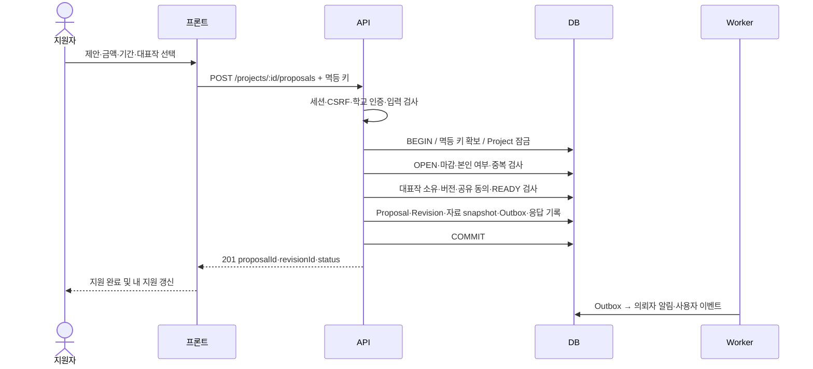
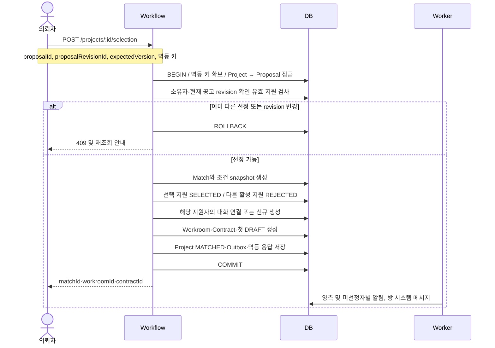
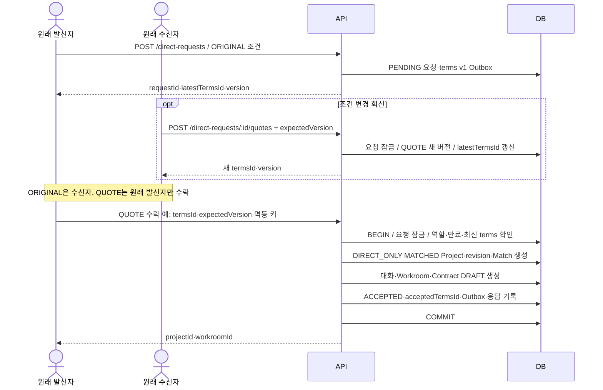
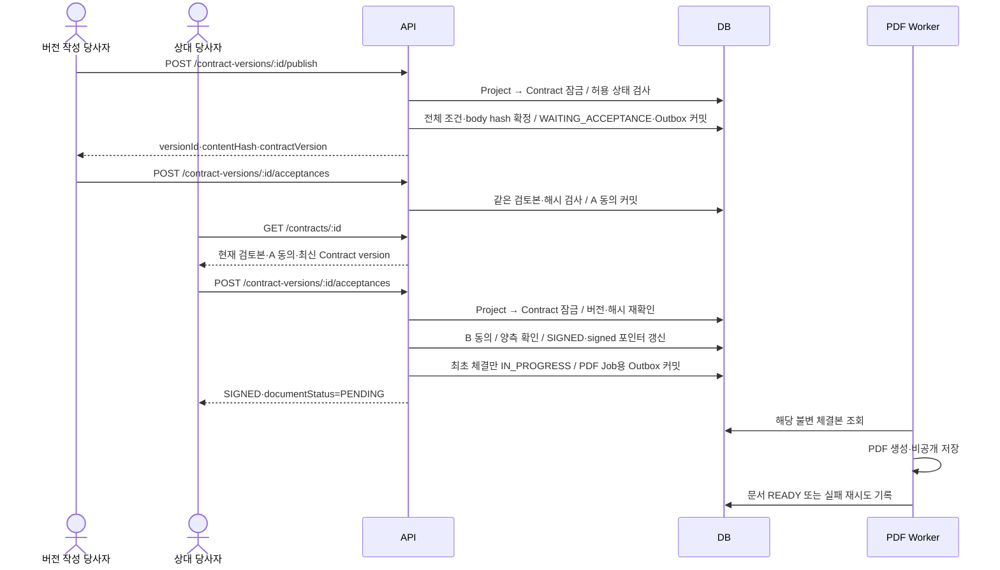
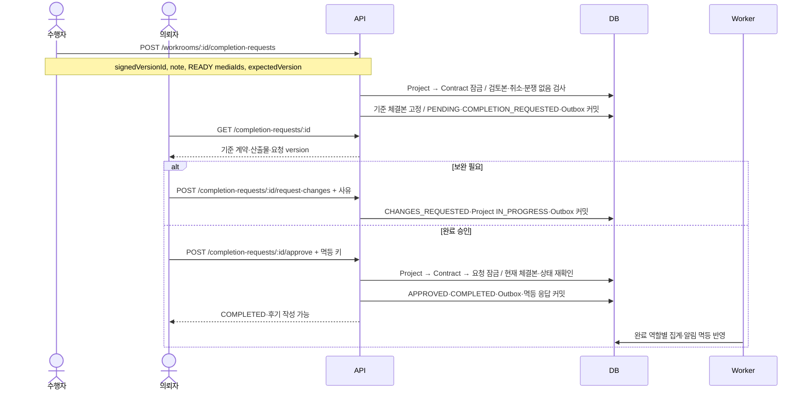

# 05. 핵심 시퀀스

기준일: 2026-10-01 · 상태: **구현 전 처리 순서 제안**

모든 경로는 `/api/v1` 아래다. 아래 DB 작업 묶음은 한 트랜잭션이며 실패하면 전체 롤백한다. 세션·CSRF·권한은 [07](07_권한_매트릭스.md), 전이는 [04](04_도메인_상태도.md), 비동기 처리는 [08](08_파일_이벤트_흐름.md)을 따른다.

## 1. 지원 제출

대표작은 선택 시 조회한 버전을 제출한다. 비공개 작업은 해당 의뢰자에게 공유한다는 명시적 동의를 요구한다. 서버가 제출 revision을 확정하기 전 성공 UI를 표시하지 않는다. 잘못된 필드 422, 중복 409, 인증 부족 403, 비공개 대상 404다.

## 2. 지원자 선정

다른 지원자의 문의 대화·첨부를 선정 방에 합치지 않는다. 첫 초안은 선택한 revision과 공고 조건을 근거로 생성하며 의뢰자가 발행 전에 확인한다. 금액·일정 차이는 조용히 덮지 않는다. SELECTED와 MATCHED가 생겨도 계약은 아직 DRAFT다.

## 3. 지정 요청 수락

견적 없는 ORIGINAL 수락도 마지막 수락 단계의 행위자만 수신자로 바뀐다. 수락과 만료·견적 갱신·취소가 경쟁하면 같은 요청 잠금으로 순서를 정한다. 이미 수락된 동일 멱등 요청에는 기존 방을 반환한다.

## 4. 계약 발행·동의

각 동의는 별도 멱등 키를 사용한다. 두 동의가 동시에 들어와 expectedVersion이 충돌하면 한쪽은 재조회 후 동일 내용인지 확인해 재시도한다. 검토본이 바뀌었다면 자동 동의하지 않는다. 변경 계약 체결 후에도 이전 체결본은 이력으로 남는다.

## 5. 완료 요청·승인

완료 허용 여부는 집계 반영을 기다리지 않고 Project 원천 상태로 판단한다. 보완 후 재요청은 새 completionRequest를 만들며 이전 기록을 수정하지 않는다. 완료 후 후기·작업물 공개 승인은 별도 명령이다.

## 6. 공통 실패 복구

| 실패 | 처리 |
| --- | --- |
| 커밋 전 오류 | 롤백, 성공 알림 없음, 폼 입력 유지 |
| 커밋 후 HTTP 응답 유실 | 같은 키·같은 body로 재요청해 저장된 결과 수신 |
| 같은 키 다른 body | 409 IDEMPOTENCY_KEY_REUSED, 새 행동은 새 키 |
| 멱등 보관 만료 | 도메인 unique와 현재 상태 검사로 중복 효과 방지; 기존 성공 응답 재현은 보장하지 않음 |
| Worker 지연·메일 실패 | 업무 상태 유지, Job 재시도·운영 경보 |
| SSE 유실 | 상세 REST와 cursor 재조회로 복구 |
| 계정·권한 변경 | 응답 재생 때도 접근 재검사, 세션·SSE 종료, 개인 캐시 제거 |

다음: [06 API 맵](06_API_맵.md) · [문서 인덱스](README.md)
