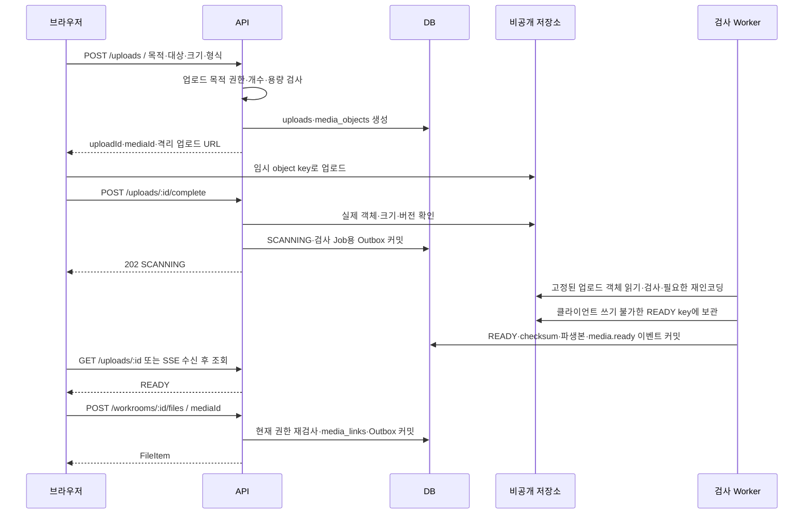
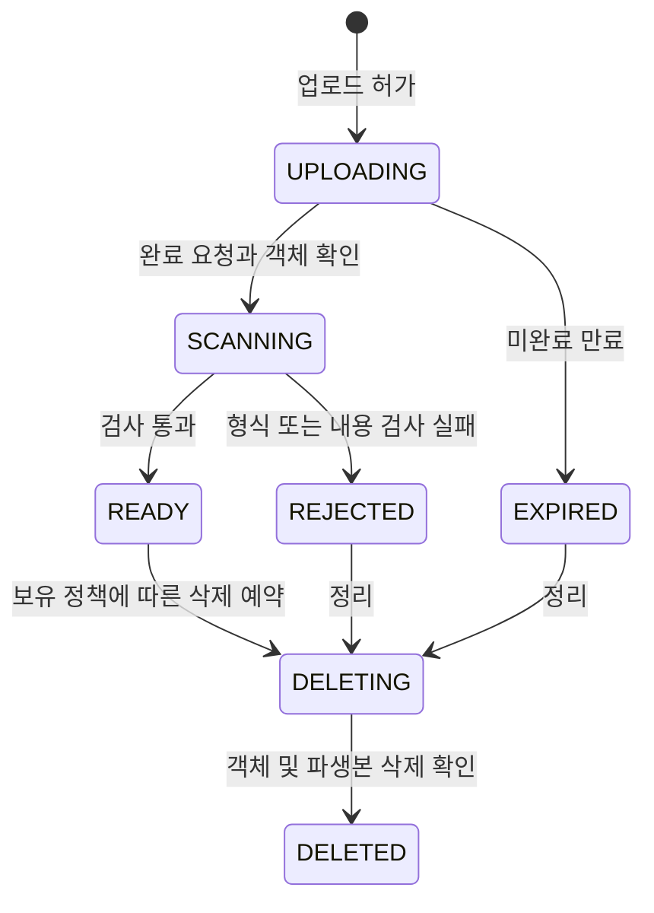
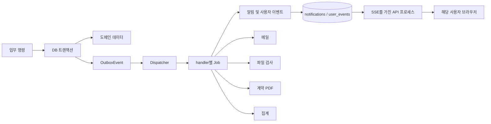

# 08. 파일·이벤트 흐름

기준일: 2026-10-01 · 상태: **구현 전 Upload / Outbox / Worker 설계 제안**

핵심 원칙은 업무 변경과 전달 요청을 함께 커밋하고, 실제 외부 작업은 이후 처리하는 것이다. [03 ERD](03_ERD.md)의 파일·이벤트 테이블과 [07 권한](07_권한_매트릭스.md)을 함께 적용한다.

## 1. 업로드·검사·연결



업로드 허가는 거래 제출 권한의 확정이 아니다. 제출/연결 시 권한·대상 상태·READY를 다시 검사한다. 아직 지원서·지정 요청 ID가 없는 경우 purpose와 부모 project/recipient 문맥으로 업로드를 예약하고, 실제 제출 트랜잭션에서 새 revision/terms에 연결한다. 프로젝트 초안은 먼저 생성한 draftId를 사용한다.

검사한 객체와 나중에 내려받는 객체가 달라지면 안 된다. 임시 키에 대한 제한 URL이 남아 있어도 최종 READY 키는 클라이언트가 덮어쓸 수 없게 한다. 저장소 버전 ID 또는 검사 전 고정 사본과 checksum으로 검사 대상을 고정하고 변동 시 실패 처리한다.

## 2. Media 상태와 파일 접근



일시적인 검사 인프라 오류는 SCANNING + 재시도 Job으로 유지하고 악성 판정 REJECTED와 구분한다. 사용자가 취소한 로컬 선택과 서버 객체 삭제 완료도 구분한다. 연결되지 않은 READY는 정리 유예 후 삭제하되 정리 Job과 새 연결은 media 잠금/상태 비교로 경쟁을 막는다.

| 파일 처리 | 규칙 |
| --- | --- |
| 유형 | 확장자뿐 아니라 실제 내용·크기 검사, 허용 형식 목록 |
| 제한 | 이미지 10MB, PDF/허용 문서 20MB, 한 제출 첨부 최대 10개 제안(D-10) |
| 워크룸 누적 | 제출당 한도와 별도로 계정·방별 저장 용량 상한 결정 필요 |
| 이미지 | 필요한 파생본 생성·재인코딩·메타데이터 제거, 원본은 비공개 |
| 영상·압축 | 초기 외부 영상 링크, 직접 업로드·압축은 검사·비용 승인 후 |
| 다운로드 | GET `/media/:id/download`, READY와 연결 대상 권한 확인 후 짧은 URL |
| 공개 취소 | 공개 파생본·CDN 무효화, 비공개 거래 원본 보존 여부는 별도 정책 |
| 외부 참고 링크 | HTTP(S) 일반 링크만, 초기 서버 미리보기 fetch 없음 |

워크룸 파일 추가는 메시지 전송과 독립 API다. 메시지 첨부 파일도 전체 파일 탭에 포함하되 같은 mediaId는 중복 제거하고 원래 출처를 표시한다. 완료 산출물·계약 PDF도 권한에 맞게 집계한다. 다른 후보 대화의 파일은 조회 대상이 아니다.

## 3. Outbox와 작업 분리



Dispatcher는 미전달 Outbox를 잠그고 handler별 Job 생성과 dispatchedAt 갱신을 함께 커밋한다. `handler+dedup_key` unique로 재실행에 안전하게 한다. Outbox의 dispatched는 메일 발송 완료가 아니라 필요한 Job이 기록되었다는 뜻이다.

Job 실행 상태는 `PENDING → RUNNING → SUCCEEDED`, 일시 실패는 `RETRY_WAIT → RUNNING`, 상한 초과는 FAILED다. claim은 짧은 DB 트랜잭션으로 leaseToken·leaseUntil을 발급한다. 작업 중 외부 I/O에 DB 행 잠금을 오래 유지하지 않는다.

완료 갱신은 현재 leaseToken과 일치할 때만 허용한다. 긴 작업은 lease를 연장하고 만료 작업은 재claim한다. backoff+jitter·최대 재시도·실패 경보·운영 재처리 사유를 기록한다. 재처리는 기존 dedup_key를 유지한다.

## 4. 이벤트 계약과 소비 효과

```json
{
  "eventId": "opaque-id",
  "type": "contract.signed",
  "schemaVersion": 1,
  "occurredAt": "2026-10-01T00:00:00Z",
  "aggregateType": "contract",
  "aggregateId": "contract-id",
  "aggregateVersion": 4,
  "data": { "projectId": "project-id", "versionId": "contract-version-id" }
}
```

| 이벤트 | 수신·후속 처리 |
| --- | --- |
| proposal.submitted/updated/resolved | 관련 의뢰자·지원자 알림, 목록 무효화 |
| project.updated/matched/cancelled | 관련 참여자 알림, 해당 방 시스템 메시지 |
| direct_request.received/quoted/resolved | 원래 상대방 알림, 요청 상태 갱신 |
| message.created/read | 해당 대화 멤버의 user_events; 일반 메일 발송은 정책 후속 |
| contract.published/accepted/signed/withdrawn | 양측 갱신, 시스템 메시지, signed는 PDF Job |
| completion.requested/resolved, project.completed | 상대 안내, 완료 시 역할별 집계 |
| cancellation.requested/resolved | 상대 안내, 프로젝트 상태 재조회 |
| review.created/visibility_changed | 역할별 평점 재계산, 대상 알림 |
| portfolio.publication_resolved | 수행자 알림, 승인 버전 배지 반영 |
| verification.changed | 본인·공개 배지 캐시 갱신 |
| media.ready/rejected, contract.document_ready | 업로더/거래 당사자에게 상태 변경 안내 |
| ticket.replied | 문의 작성자 안내 |

DB 내 소비는 `processed_events(consumer,eventId)`와 결과 쓰기를 같은 트랜잭션으로 처리한다. 알림은 recipient+event, 시스템 메시지는 conversation+sourceEvent, 문서는 contractVersion+작업 종류에 해당하는 dedup key로 중복 효과를 막는다.

메일처럼 외부 부수 효과는 공급자 멱등 지원 여부에 따라 중복 발송 가능성이 남는다. 발송 결과·공급자 ID를 추적하고 중복 메일이 거래 명령을 재실행하지 않게 한다. PDF 저장 성공 후 DB 갱신 실패는 동일 불변 버전 키로 재사용한다. Exactly-once 네트워크 전달을 약속하지 않는다.

## 5. Worker → API → SSE 전달

초기안은 브로커 대신 수신자별 DB 이벤트 로그를 사용한다. Worker는 notifications와 user_events를 기록한다. API 프로세스는 자기 인스턴스에 연결된 사용자의 이벤트를 짧은 간격으로 조회해 SSE로 보낸다. 이는 구현 제안이며 polling 간격·동시 접속 한도는 부하 측정으로 정한다.

1. 사용자별 recipient_streams 행을 잠그고 sequence를 증가시킨 뒤 user_events를 같은 트랜잭션에 추가한다. 여러 수신자 잠금은 userId 정렬 순서다.
2. 단순 전역 증가 ID가 커밋 순서를 보장한다고 가정하지 않는다. 사용자별 잠금으로 뒤 순번 커밋을 먼저 전달하고 앞 이벤트를 놓치는 문제를 막는다.
3. SSE `id`는 현재 사용자의 전달 sequence, payload.eventId는 도메인 이벤트 ID다. 서로 용도가 다르다.
4. `Last-Event-ID` 또는 초기 `after` cursor로 재개한다. 다른 사용자의 cursor로 데이터를 조회하지 못한다.
5. 보관 범위를 벗어나면 `stream.reset` 제어 이벤트로 REST 재동기화를 요구한다. 클라이언트는 현재 방 메시지·알림·업무 상태를 재조회한다.
6. 도메인 작업은 순서가 뒤바뀔 수 있다. aggregateVersion이 오래된 이벤트는 상태 덮어쓰기에 쓰지 않고 필요하면 최신 REST를 조회한다. 메시지 정렬은 방 sequence가 기준이다.
7. 이벤트 생성 시와 전송 시 현재 수신 권한을 검사한다. 로그아웃·정지·멤버십 변경은 연결 종료 또는 재검증한다.

재동기화 중 새 변경 누락을 막기 위해 reset 응답에 replay 시작 cursor를 제공하고, 그 지점부터 이벤트를 받으면서 REST snapshot을 반영한 뒤 버전 비교로 병합한다. 재연결 기록 보관 기간은 운영 설정이며 Outbox·업무 기록의 보유 기간과 다르다.

## 6. 필수 장애 검증

- 업로드 URL 만료, complete 중복, 타인 key, 검사 전 첨부, 검사 후 임시 키 재업로드.
- 정리 Job과 파일 연결 경쟁, 공개 취소 후 CDN 접근, 분쟁 보존 파일 삭제 방지.
- DB 커밋 직후 API 종료, Dispatcher Job 생성 중 종료, Worker lease 만료 후 중복 실행.
- PDF/메일 외부 성공 후 결과 저장 실패, FAILED 재처리, 집계 재계산.
- 두 API 인스턴스·다중 탭·SSE 연결 해제, cursor 만료·응답 역전, 권한 철회.

다음: [09 배포 구조](09_배포_구조.md) · [문서 인덱스](README.md)
