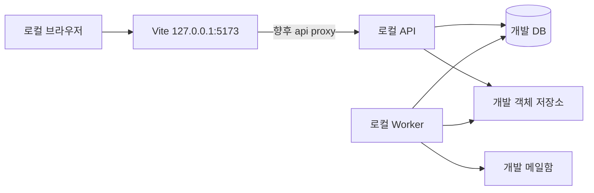
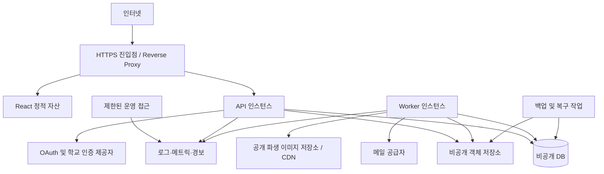

# 09. 배포 구조

기준일: 2026-10-01 · 상태: **dev / staging / production 운영 설계 제안**

실제 서버·클라우드·CI·DB를 생성한 문서가 아니다. 사업자·리전·스펙·트래픽·예산은 D-03, 언어·프레임워크는 D-01 결정 후 구현한다. 동일 코드의 API와 Worker를 서로 다른 실행 역할로 배포하는 기본안이다.

## 1. 환경별 구성

| 항목 | dev | staging | production |
| --- | --- | --- | --- |
| 프론트 | Vite 개발 서버 | 빌드 정적 파일 | 검증된 동일 빌드 정적 파일 |
| API·Worker | 로컬 별도 프로세스 | 운영과 같은 실행 역할 | 별도 프로세스/컨테이너 |
| DB | 개발 DB | 격리 DB | 운영 전용 DB·백업 |
| 파일 | 개발용 저장소 | 별도 bucket·권한 | 비공개 원본과 공개 파생본 분리 |
| 메일 | 개발 수신함 | 수신자 allowlist | 승인된 발신자·제한·반송 관측 |
| OAuth·학교 인증 | 개발 앱/합성 fixture | 별도 callback·테스트 계정 | 운영 앱·실제 검증 수단 |
| 데이터 | 합성 seed | 합성 통합 테스트 데이터 | 운영 기준 사전만 seed |
| 비밀 | Git 제외 로컬 설정 | 별도 secret store/주입 | 최소 권한 secret 주입·회전 |
| 접근 | loopback | 팀 제한 접근 | 공개 서비스·운영 접근 분리 |

운영 개인정보를 dev/staging에 복제하지 않는다. 테스트 학교 인증 fixture를 운영에 켤 수 있는 일반 사용자 API를 만들지 않는다. 환경별 OAuth client와 쿠키·저장소를 분리하고 staging 세션이 production에서 유효하지 않게 한다.

## 2. 로컬 개발

현재 실행 가능한 명령은 `frontend`의 `npm run dev`, `npm test`, `npm run build`, `npm run test:e2e`다. API 프록시·백엔드 실행·migration·Worker·개발 서비스 구성은 아직 구현되지 않았다. 향후 프론트는 상대 경로 `/api/v1`로 호출하고 Vite 프록시를 통해 개발 세션·CSRF 흐름을 맞춘다.

개발 HTTP 쿠키 설정 예외는 dev 프로필에만 한정한다. staging/production은 HTTPS와 Secure 쿠키를 사용한다. 실제 배포와 동일한 쿠키·OAuth callback 검증은 HTTPS staging에서 수행한다.

## 3. 운영 네트워크

DB와 운영 제어 인터페이스는 공개 웹 경로에 노출하지 않는다. API·Worker·migration·백업 역할별 자격 증명을 분리한다. 객체 저장소 public 설정으로 원본을 공개하지 않고 제한 URL 또는 승인된 파생본만 노출한다.

| 경로 | 라우팅·캐시 |
| --- | --- |
| `/assets/*` | 내용 해시 정적 파일, 긴 캐시 |
| `/` 및 SPA 경로 | index.html fallback, 새 배포 확인 가능한 짧은 캐시 |
| `/api/v1/*` | API 오류는 JSON, index.html fallback 금지 |
| `/api/v1/events` | SSE, buffering 끄기·heartbeat·timeout 조정·연결 제한 |
| 공개 이미지 | 별도 파생본 캐시, unpublish 무효화 |
| 개인화·거래 API | no-store, CDN 공유 캐시 제외 |

객체 저장소 직접 업로드의 CORS는 실제 웹 origin과 필요한 메서드·헤더만 허용한다. 제한 URL·메일 토큰·OAuth code·쿠키는 proxy/애플리케이션 로그에서 제거한다.

## 4. 환경 설정 계약

아래 이름은 제안이다. `.env.example`와 설정 검증 코드가 만들어진 상태는 아니다.

| 그룹 | 예시 설정 | 적용 대상 |
| --- | --- | --- |
| 공통 | APP_ENV, PUBLIC_BASE_URL, PROCESS_ROLE | API/Worker |
| DB | DATABASE_URL, DB_POOL_SIZE | API/Worker, migration은 별도 계정 |
| 세션 | SESSION_COOKIE_NAME, SESSION_IDLE_TTL, SESSION_ABSOLUTE_TTL, REMEMBER_ABSOLUTE_TTL, ALLOWED_ORIGINS | API |
| OAuth·학교 | 제공자별 client ID/secret, callback URL, 인증 어댑터 설정 | API |
| 저장소 | STORAGE_ENDPOINT, PRIVATE_BUCKET, PUBLIC_MEDIA_BUCKET, UPLOAD_LIMITS | API/Worker |
| 작업 | JOB_LEASE_SECONDS, JOB_MAX_ATTEMPTS, JOB_BACKOFF, EVENT_RETENTION | Worker/API |
| 메일 | MAIL_ADAPTER, MAIL_FROM, 공급자 비밀, STAGING_RECIPIENT_ALLOWLIST | Worker |
| 관측 | LOG_LEVEL, 오류 수집·메트릭 endpoint | API/Worker |

브라우저에는 공개 API 경로 등 공개 설정만 전달한다. DB·메일·저장소·OAuth secret은 VITE 변수에 넣지 않는다. 필수 설정이 없으면 시작 시 명확히 실패하고 운영에서 데모 모드로 대체하지 않는다.

## 5. CI와 배포 순서

1. frontend build/unit/E2E, backend 도메인·실제 DB 통합, 권한·OpenAPI consumer contract 검증.
2. migration을 빈 DB와 이전 배포 schema 모두에 적용하고 seed의 운영/합성 데이터를 분리 검사.
3. 의존성·비밀 포함 여부 검사 후 버전이 고정된 빌드 산출물 생성.
4. staging에서 가입 → 두 사용자 지원/선정 → 계약 → 파일 → 완료의 smoke test 수행.
5. 운영 백업·호환성·복구 담당자 확인 후 additive migration을 단일 migration 작업으로 실행.
6. 호환 API/Worker 배포, readiness 통과 후 트래픽 전환, 정적 파일 배포.
7. 오류·DB 잠금·Outbox 적체·SSE 재연결·파일 검사 지연을 관찰하고 제거 migration은 후속 배포로 분리.

이벤트 payload에는 호환 가능한 schema를 유지한다. 새 Worker만 이해하는 이벤트를 구 Worker가 소비하지 않도록 소비자 지원 버전과 배포 순서를 검증한다. 실행 중 Worker 종료는 신규 claim 중지 → 작업 마무리/lease 회수, API 종료는 신규 요청 중지 → SSE 재연결 허용 순서로 처리한다.

## 6. 상태 검사와 관측

| 항목 | 기준 |
| --- | --- |
| Liveness | 프로세스 이벤트 루프/런타임 생존. 외부 메일 장애로 반복 재시작하지 않음 |
| Readiness | DB·필수 schema 등 요청 처리에 필요한 의존성 사용 가능. 상세 오류는 내부만 |
| API | 오류율·p95·권한 거절·429·요청 크기 |
| DB | 연결 풀·느린 쿼리·잠금 대기·디스크·복제/백업 상태 |
| Worker | 가장 오래된 미처리 이벤트 나이, Job 실패·재시도·lease 만료 |
| 파일 | 검사 지연·격리 저장량·거절·미연결 파일·삭제 실패 |
| SSE | 연결 수·재연결·전달 지연·reset 비율 |
| 외부 | 메일 실패/반송, OAuth/학교 인증 오류 |

현재 검증 계획의 읽기 p95 500ms, 쓰기 p95 1s, 상대 이벤트 p95 2s는 측정 목표 제안이다. 데이터량·동시 사용자·환경 없이 달성됐다고 표현하지 않는다. 경보마다 담당자·연락 경로·재처리 runbook을 지정한다.

## 7. 롤백·백업·복구

- schema 변경은 추가 → 호환 앱 → backfill → 제약 강화 → 제거로 나눈다. 운영 시작 때 테이블 자동 초기화 금지.
- 앱 롤백은 호환되는 이전 이미지로 되돌린다. 제거된 컬럼·잃은 파일을 앱 롤백으로 복구할 수는 없다.
- DB와 객체 저장소를 함께 백업하고 암호화·접근 역할·보관 기간을 분리한다. 복구 지점의 DB가 참조하는 파일을 복원할 수 있어야 한다.
- 복구 시 Outbox·Job·멱등 기록도 포함한다. 외부 메일 재발송 가능성과 파일 고아 객체를 확인한다.
- 초기 RPO 24시간/RTO 4시간은 기존 검토안이며 D-03 승인·복구 연습 전 보장값이 아니다.
- 폐기·탈퇴·분쟁 보존(D-06)을 백업 수명과 연결한다. 복원으로 삭제 대상이 다시 공개되지 않도록 삭제 이력 재적용 절차를 둔다.

## 8. 공개 운영 전 완료 조건

- 두 사용자 세션·찜·초안·방·파일·알림 격리, 타인 ID 접근 차단.
- 동시 선정 1건, 오래된 견적·계약 동의 거절, 완료·변경 계약 경쟁 검증.
- 파일 검사 전 노출 차단, 직접 파일함 연결·다운로드·공개 취소 확인.
- 멱등 재전송·Worker 중복 실행·SSE cursor 만료 복구 확인.
- 최소 문의·신고 처리 담당자, 감사 접근, 학교 인증·정지 정책 준비.
- 예시 후기·인증 배지·브라우저 계정의 운영 자동 이관 없음.
- DB+파일 복구 연습과 실제 실패 Job 재처리 기록 확보.

[문서 인덱스](README.md) · [개발·검증 계획](개발_검증_계획.md)
