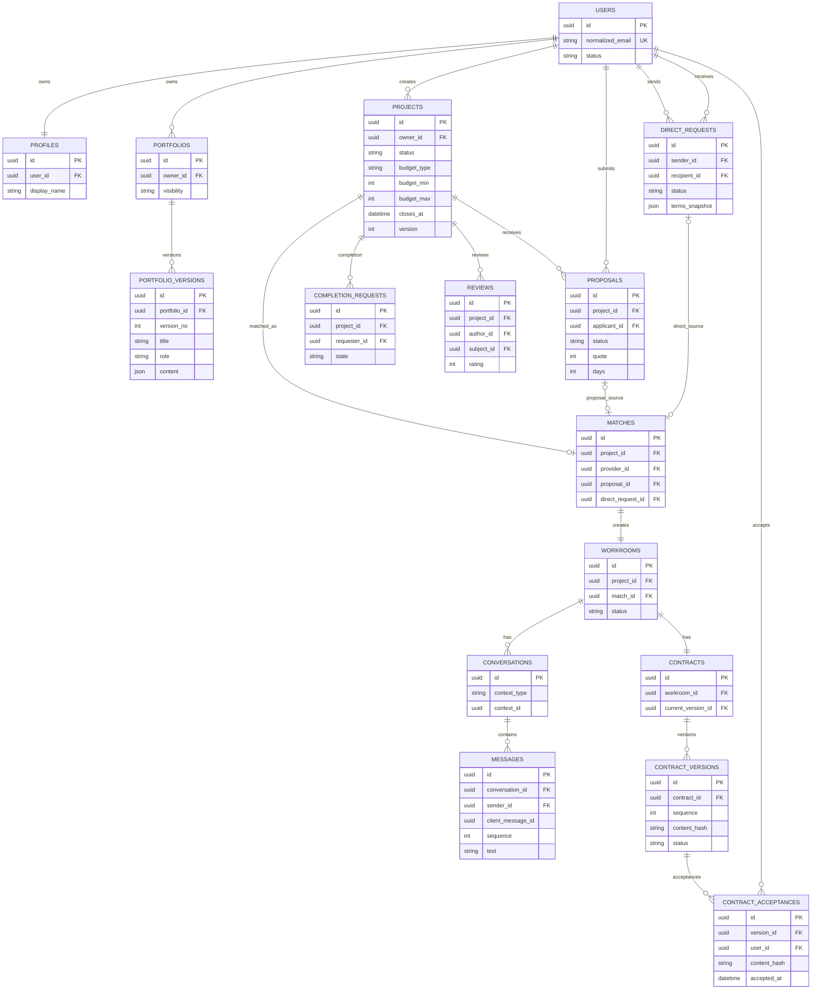
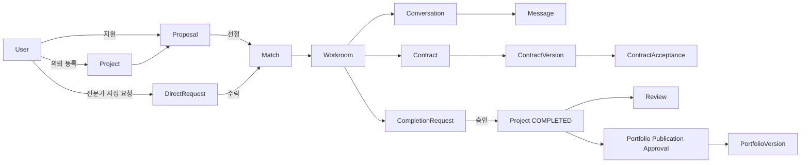
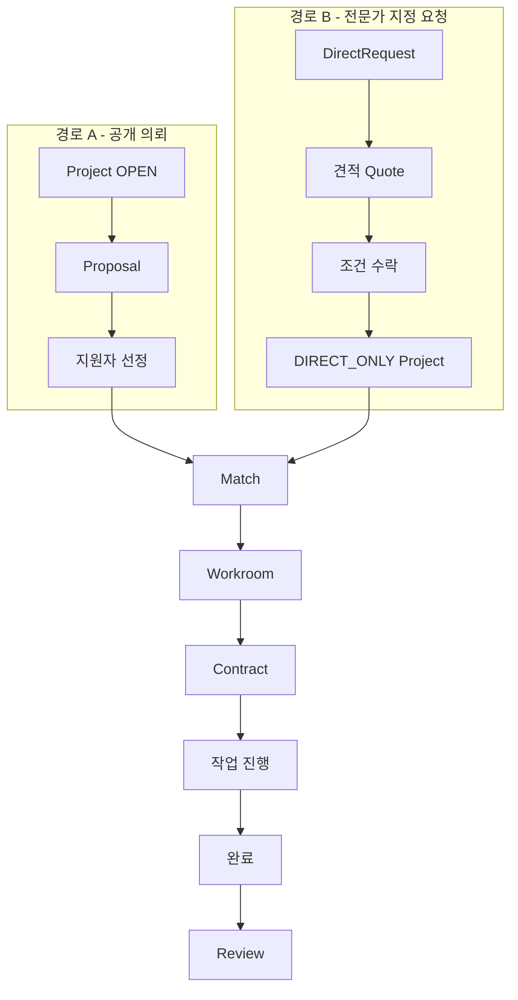

# 백석대학교 긱창업 플랫폼 ERD

> 기준일: 2026-09-30  
> 상태: 백엔드 구현 전 논리 ERD 초안  
> 기준 문서: `데이터_API_계약.md`, `백엔드_설계.md`, `시스템_아키텍처.md`

## 1. 전체 ERD

```mermaid
erDiagram

    USERS {
        uuid id PK
        string normalized_email UK
        string password_hash
        string status
        datetime email_verified_at
    }

    SESSIONS {
        uuid id PK
        uuid user_id FK
        string token_hash
        datetime expires_at
        datetime revoked_at
        string purpose
    }

    CONSENTS {
        uuid id PK
        uuid user_id FK
        string document_type
        string document_version
        datetime agreed_at
        datetime withdrawn_at
    }

    SCHOOL_VERIFICATIONS {
        uuid id PK
        uuid user_id FK
        string method
        string affiliation_type
        string state
        datetime expires_at
        uuid evidence_media_id FK
    }

    PROFILES {
        uuid id PK
        uuid user_id FK
        string display_name
        string headline
        string bio
        string availability
        string visibility
    }

    CAREERS {
        uuid id PK
        uuid profile_id FK
        string title
        string description
        date start_date
        date end_date
    }

    OFFERED_SERVICES {
        uuid id PK
        uuid profile_id FK
        string title
        string description
        int expected_days
        int expected_amount
    }

    CATEGORIES {
        uuid id PK
        string label
        boolean enabled
        int sort_order
    }

    SERVICE_FIELDS {
        uuid id PK
        uuid parent_category_id FK
        string label
        boolean enabled
        int sort_order
    }

    SKILLS {
        uuid id PK
        string normalized_label UK
    }

    SKILL_ALIASES {
        uuid id PK
        uuid skill_id FK
        string alias
    }

    FIELD_SKILLS {
        uuid field_id PK,FK
        uuid skill_id PK,FK
    }

    PROFILE_FIELDS {
        uuid profile_id PK,FK
        uuid field_id PK,FK
    }

    PROFILE_SKILLS {
        uuid profile_id PK,FK
        uuid skill_id PK,FK
    }

    PORTFOLIOS {
        uuid id PK
        uuid owner_id FK
        string visibility
        uuid current_version_id FK
    }

    PORTFOLIO_VERSIONS {
        uuid id PK
        uuid portfolio_id FK
        int version_no
        string title
        string role
        string summary
        uuid field_id FK
        json content
        datetime created_at
    }

    PORTFOLIO_MEDIA {
        uuid id PK
        uuid portfolio_version_id FK
        uuid media_id FK
        int display_order
    }

    FEATURED_PORTFOLIOS {
        uuid profile_id PK,FK
        uuid portfolio_id PK,FK
        int display_order
    }

    PROJECTS {
        uuid id PK
        uuid owner_id FK
        string visibility
        string status
        string budget_type
        int budget_min
        int budget_max
        datetime closes_at
        int days
        string mode
        int version
    }

    PROJECT_REVISIONS {
        uuid id PK
        uuid project_id FK
        int revision_no
        json snapshot
        datetime created_at
    }

    PROJECT_FIELDS {
        uuid project_id PK,FK
        uuid field_id PK,FK
    }

    PROJECT_SKILLS {
        uuid project_id PK,FK
        uuid skill_id PK,FK
    }

    PROPOSALS {
        uuid id PK
        uuid project_id FK
        uuid applicant_id FK
        uuid project_revision_id FK
        string status
        int quote
        int days
        string content
        int version
    }

    PROPOSAL_PORTFOLIO_SNAPSHOTS {
        uuid id PK
        uuid proposal_id FK
        uuid portfolio_version_id FK
        json snapshot_metadata
    }

    DIRECT_REQUESTS {
        uuid id PK
        uuid sender_id FK
        uuid recipient_id FK
        string status
        datetime expires_at
        json terms_snapshot
        int quote_version
        uuid final_quote_id
    }

    MATCHES {
        uuid id PK
        uuid project_id FK
        uuid provider_id FK
        uuid proposal_id FK
        uuid direct_request_id FK
        datetime created_at
    }

    WORKROOMS {
        uuid id PK
        uuid project_id FK
        uuid match_id FK
        string status
    }

    CONVERSATIONS {
        uuid id PK
        string context_type
        uuid context_id
        uuid owner_id FK
        uuid provider_id FK
        datetime created_at
    }

    CONVERSATION_MEMBERS {
        uuid conversation_id PK,FK
        uuid user_id PK,FK
        int last_read_sequence
    }

    MESSAGES {
        uuid id PK
        uuid conversation_id FK
        uuid sender_id FK
        uuid client_message_id
        int sequence
        string kind
        string text
        datetime created_at
    }

    CONTRACTS {
        uuid id PK
        uuid workroom_id FK
        uuid current_version_id FK
    }

    CONTRACT_VERSIONS {
        uuid id PK
        uuid contract_id FK
        int sequence
        string body
        string content_hash
        string status
        datetime created_at
    }

    CONTRACT_ACCEPTANCES {
        uuid id PK
        uuid version_id FK
        uuid user_id FK
        string content_hash
        datetime accepted_at
    }

    COMPLETION_REQUESTS {
        uuid id PK
        uuid project_id FK
        uuid requester_id FK
        string state
        string note
        json media_refs
        int version
    }

    REVIEWS {
        uuid id PK
        uuid project_id FK
        uuid author_id FK
        uuid subject_id FK
        int rating
        string body
        string visibility
    }

    PUBLICATION_APPROVALS {
        uuid id PK
        uuid project_id FK
        uuid portfolio_version_id FK
        uuid requester_id FK
        string state
        uuid decided_by FK
    }

    MEDIA_OBJECTS {
        uuid id PK
        uuid owner_id FK
        string object_key
        string state
        string mime
        int size
        string checksum
    }

    MEDIA_LINKS {
        uuid id PK
        uuid media_id FK
        string target_type
        uuid target_id
    }

    FAVORITES {
        uuid id PK
        uuid user_id FK
        string target_type
        uuid target_id
    }

    NOTIFICATIONS {
        uuid id PK
        uuid recipient_id FK
        uuid event_id
        string type
        string target_ref
        datetime read_at
    }

    REPORTS {
        uuid id PK
        uuid reporter_id FK
        string target_ref
        string reason
        string status
        uuid assignee_id FK
    }

    SUPPORT_TICKETS {
        uuid id PK
        uuid reporter_id FK
        string reason
        string status
        uuid assignee_id FK
    }

    AUDIT_LOGS {
        uuid id PK
        uuid actor_id FK
        string action
        string target
        string reason
        string request_id
        datetime created_at
    }

    OUTBOX_EVENTS {
        uuid id PK
        uuid event_id UK
        string event_type
        uuid aggregate_id
        int aggregate_version
        json payload
        string state
        datetime created_at
    }

    JOBS {
        uuid id PK
        string type
        json payload
        string state
        int retry_count
        datetime next_run_at
    }

    %% 계정 / 인증
    USERS ||--o{ SESSIONS : has
    USERS ||--o{ CONSENTS : agrees
    USERS ||--o{ SCHOOL_VERIFICATIONS : requests
    USERS ||--|| PROFILES : owns
    MEDIA_OBJECTS o|--o{ SCHOOL_VERIFICATIONS : evidence

    %% 프로필 / 분야 / 기술
    PROFILES ||--o{ CAREERS : has
    PROFILES ||--o{ OFFERED_SERVICES : offers
    CATEGORIES ||--o{ SERVICE_FIELDS : contains
    SERVICE_FIELDS ||--o{ FIELD_SKILLS : maps
    SKILLS ||--o{ FIELD_SKILLS : maps
    SKILLS ||--o{ SKILL_ALIASES : aliases
    PROFILES ||--o{ PROFILE_FIELDS : selects
    SERVICE_FIELDS ||--o{ PROFILE_FIELDS : assigned
    PROFILES ||--o{ PROFILE_SKILLS : selects
    SKILLS ||--o{ PROFILE_SKILLS : assigned

    %% 포트폴리오
    USERS ||--o{ PORTFOLIOS : owns
    PORTFOLIOS ||--o{ PORTFOLIO_VERSIONS : versions
    SERVICE_FIELDS ||--o{ PORTFOLIO_VERSIONS : category
    PORTFOLIO_VERSIONS ||--o{ PORTFOLIO_MEDIA : contains
    MEDIA_OBJECTS ||--o{ PORTFOLIO_MEDIA : attaches
    PROFILES ||--o{ FEATURED_PORTFOLIOS : features
    PORTFOLIOS ||--o{ FEATURED_PORTFOLIOS : selected

    %% 프로젝트
    USERS ||--o{ PROJECTS : owns
    PROJECTS ||--o{ PROJECT_REVISIONS : revisions
    PROJECTS ||--o{ PROJECT_FIELDS : categorized
    SERVICE_FIELDS ||--o{ PROJECT_FIELDS : assigned
    PROJECTS ||--o{ PROJECT_SKILLS : requires
    SKILLS ||--o{ PROJECT_SKILLS : required

    %% 공개 지원
    PROJECTS ||--o{ PROPOSALS : receives
    USERS ||--o{ PROPOSALS : submits
    PROJECT_REVISIONS ||--o{ PROPOSALS : based_on
    PROPOSALS ||--o{ PROPOSAL_PORTFOLIO_SNAPSHOTS : includes
    PORTFOLIO_VERSIONS ||--o{ PROPOSAL_PORTFOLIO_SNAPSHOTS : snapshot_of

    %% 지정 요청
    USERS ||--o{ DIRECT_REQUESTS : sends
    USERS ||--o{ DIRECT_REQUESTS : receives

    %% 매칭
    PROJECTS ||--o| MATCHES : produces
    PROPOSALS o|--o| MATCHES : source
    DIRECT_REQUESTS o|--o| MATCHES : source
    USERS ||--o{ MATCHES : provider
    MATCHES ||--|| WORKROOMS : creates
    PROJECTS ||--o| WORKROOMS : has

    %% 대화
    CONVERSATIONS ||--o{ CONVERSATION_MEMBERS : members
    USERS ||--o{ CONVERSATION_MEMBERS : participates
    CONVERSATIONS ||--o{ MESSAGES : contains
    USERS ||--o{ MESSAGES : sends

    %% 계약
    WORKROOMS ||--|| CONTRACTS : has
    CONTRACTS ||--o{ CONTRACT_VERSIONS : versions
    CONTRACT_VERSIONS ||--o{ CONTRACT_ACCEPTANCES : acceptances
    USERS ||--o{ CONTRACT_ACCEPTANCES : accepts

    %% 완료 / 후기
    PROJECTS ||--o{ COMPLETION_REQUESTS : completion
    USERS ||--o{ COMPLETION_REQUESTS : requests
    PROJECTS ||--o{ REVIEWS : reviews
    USERS ||--o{ REVIEWS : writes
    USERS ||--o{ REVIEWS : receives
    PROJECTS ||--o{ PUBLICATION_APPROVALS : verifies
    PORTFOLIO_VERSIONS ||--o{ PUBLICATION_APPROVALS : target
    USERS ||--o{ PUBLICATION_APPROVALS : requests

    %% 파일
    USERS ||--o{ MEDIA_OBJECTS : owns
    MEDIA_OBJECTS ||--o{ MEDIA_LINKS : linked

    %% 사용자 기능 / 운영
    USERS ||--o{ FAVORITES : saves
    USERS ||--o{ NOTIFICATIONS : receives
    USERS ||--o{ REPORTS : reports
    USERS ||--o{ SUPPORT_TICKETS : creates
    USERS o|--o{ AUDIT_LOGS : actor
```

## 2. 핵심 도메인 축약 ERD

전체 ERD가 너무 크면 아래 핵심 흐름만 먼저 보면 된다.

## 3. 핵심 제약

### 사용자 / 프로필
- `users.normalized_email` UNIQUE
- 사용자당 `profile` 1개
- 학교 인증과 공개 프로필은 별도 관리

### 지원
- `(project_id, applicant_id)` UNIQUE
- 사용자는 자신의 프로젝트에 지원할 수 없음
- 지원 시 선택한 포트폴리오는 `portfolio_version` 기준으로 스냅샷 저장

### 매칭
- MVP에서는 프로젝트당 수행자 1명
- `matches.project_id` UNIQUE
- `matches.proposal_id`와 `matches.direct_request_id`는 둘 중 정확히 하나만 존재
- 공개 지원 기반 매칭 또는 지정 요청 기반 매칭을 하나의 `Match` 구조로 통합

### 워크룸
- `workrooms.project_id` UNIQUE
- `workrooms.match_id` UNIQUE
- Match 생성 트랜잭션에서 Workroom도 함께 생성

### 메시지
- `(conversation_id, sequence)` UNIQUE
- `(conversation_id, sender_id, client_message_id)` UNIQUE
- 재전송 시 동일 메시지가 중복 생성되지 않도록 멱등 처리

### 계약
- 워크룸당 계약 1개
- 계약에는 여러 버전 존재 가능
- `(version_id, user_id)` UNIQUE
- 체결된 계약 버전은 불변
- 동일한 최신 계약 버전에 양측 모두 동의해야 SIGNED

### 완료 / 후기
- 프로젝트별 활성 완료 요청 1개
- `(project_id, author_id)` UNIQUE
- 실제 완료된 프로젝트의 당사자만 후기 작성 가능

### 포트폴리오
- Portfolio와 PortfolioVersion을 분리
- 지원서나 공개 승인에서는 특정 `portfolio_version`을 참조
- 이후 포트폴리오가 수정되어도 과거 지원 당시 내용은 유지

### 파일
- 실제 파일은 DB가 아닌 비공개 Object Storage에 저장
- DB에는 object key, MIME type, size, checksum, 상태 등의 메타데이터 저장
- 권한 확인 후 짧은 수명의 다운로드 URL 발급

## 4. 핵심 데이터 흐름

## 5. Match 생성 경로

두 가지 서로 다른 사용자 흐름이 최종적으로 같은 거래 모델로 합쳐진다.

---

## 주의

이 문서는 현재 구현된 물리 DB를 설명하는 문서가 아니라 **백엔드 구현 전에 검토 중인 논리 데이터 모델**이다.

특히 다음 항목은 구현 전에 추가 확정이 필요하다.

- 백엔드 프레임워크
- 실제 PostgreSQL 컬럼 타입과 길이
- FK `ON DELETE` 정책
- 개인정보 보유 및 삭제 정책
- 학교 인증 방식
- 포트폴리오 `content` JSON 스키마
- `MEDIA_LINKS` 다형 관계 구현 방식
- DirectRequest 견적 이력 구조
- 관리자 권한 모델
